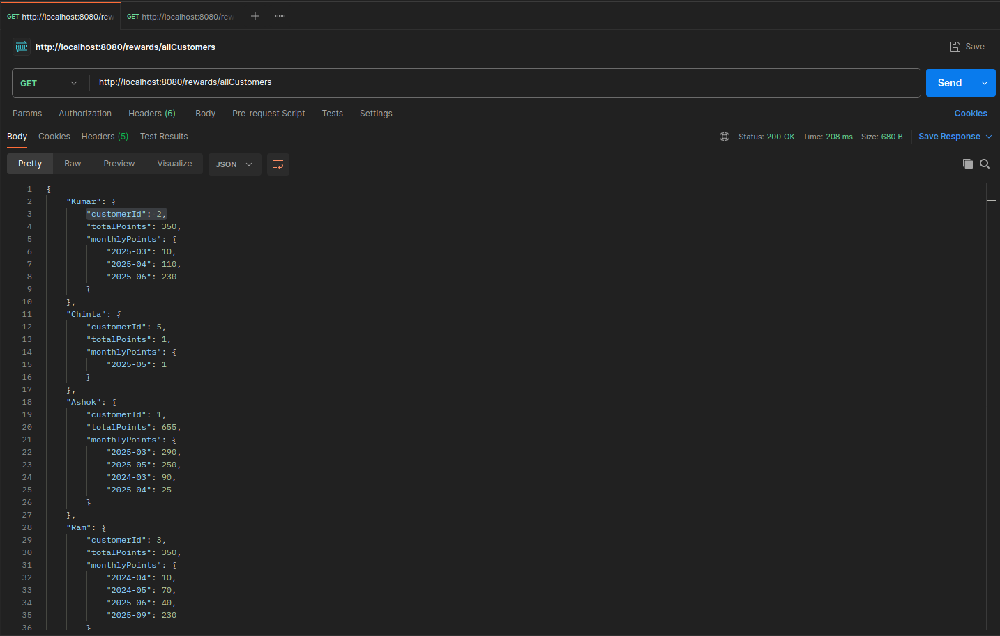
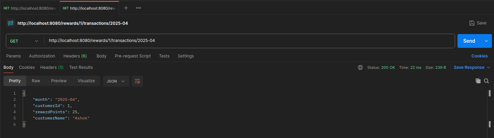
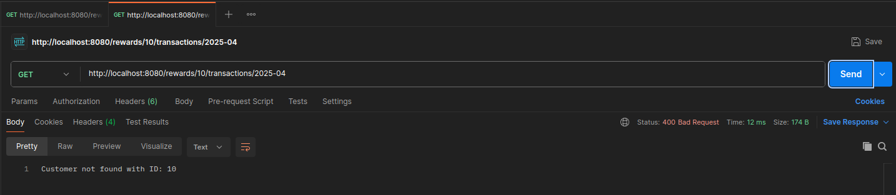

# Customer Rewards Program - Spring Boot Application

This project is a Spring Boot REST API that calculates **reward points for customers** based on their transactions.

## 🎯 Objective

Customers earn points for every dollar spent:
- **2 points** for every dollar over **$100**.
- **1 point** for every dollar between **$50 and $100**.

> Example: A $120 purchase gives `2×20 + 1×50 = 90 points`.

The API calculates:
- Reward points **per customer per month**.
- **Total** reward points per customer.

---

## 📦 Project Structure

```text
src/
 └── main/
     ├── java/com/capgemini/reward_program/
     │    ├── controller/         --> REST API controller
     │    ├── service/            --> Business logic
     │    ├── model/              --> POJOs for Customer and Transaction
     │    └── exception/          --> Global exception handling
     └── resources/
          └── application.properties
```

## 🧪 API Testing with Postman

### 1. Get All Customer Rewards
**Endpoint:** `GET /rewards/allCustomers`



---

### 2. Get Monthly Reward for Specific Customer
**Endpoint:** `GET /rewards/1/transactions/2025-04`



### 3. Get Monthly Reward for Not available Customer
**Endpoint:** `GET /rewards/10/transactions/2025-04`



### 2. Get Monthly Reward with Invalid Month
**Endpoint:** `GET /rewards/1/transactions/04-2025`


